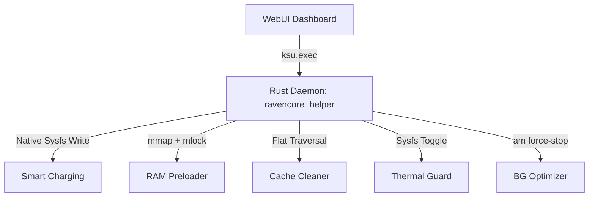

# Ravencore

  

  
  
  
  
  

---

**Ravencore** is a premium, lightweight system utility and optimization module designed for rooted Android devices. Powered by a high-performance **native Rust daemon** (`ravencore_helper`), it delivers granular system-level enhancements—including charging controls, dynamic resolution downscaling, native memory preloading, and safe thermal management—without risky kernel alterations or device instability. It features a modern, high-performance **WebUI Dashboard** for real-time monitoring and seamless utility configuration.

**Ravencore** はルート化されたAndroidデバイス向けに設計された、軽量で高性能なシステムユーティリティモジュールです。ネイティブの**Rustデーモン**により、カーネル改変なしで安全なシステムレベル最適化を実現します。

---

## ⚡ Core Features / 機能一覧

### 🖥️ Premium WebUI Dashboard
* **Real-Time Monitoring:** Track active CPU/GPU frequencies, RAM footprint, battery health, temperature, charging current, and voltage in real-time.
  リアルタイムでCPU/GPU周波数、メモリ、バッテリー状態、温度、充電電流を監視。
* **Interactive Floating Widgets:** Clean, glow-styled floating status indicators displaying active device info, kernel version, and daemon states.
* **Live Log Viewers:** Real-time log capture for background daemon status and asset preloading events with auto-scroll features.

### 🎮 Game Booster & Preloader / ゲーム最適化
* **Resolution Downscaling:** Adjust custom resolution downscaling ratios per game package to maximize FPS on mid-range hardware.
  ゲームごとにカスタム解像度ダウンスケーリングを調整し、FPSを最大化。
* **Native RAM Preloading:** Preloads game libraries and assets into RAM using C-level memory mapping and page-locking (`mmap` + `mlock` + `madvise`), preventing Android from paginating out game assets.
* **Auto-Launch Cleanup:** Instantly cleans RAM, flushes drop caches, and suspends system battery limits when optimized games start.

### 🔋 Battery & Thermal Safety / バッテリー安全管理
* **Smart Fast Charging:** Safely unlocks maximum charging speeds based on real-time temperature. Throttles to `1.5A` if battery temp reaches 42°C, restoring full input current under 38°C.
  リアルタイム温度に基づき最大充電速度を安全に解放。42°C以上で自動スロットル。
* **Automated Bypass Charging:** Draw power directly from the charger instead of the battery during active gaming to minimize heat buildup and maximize battery lifespan.
* **Active Battery Saver:** Allocates background threads/cgroups to efficiency cores (CPU 0-3), whitelists critical messenger services, and forces deep Doze state when the screen is off.

### ⚙️ Automation & Maintenance / 自動メンテナンス
* **Flat-Traversal Cache Cleaner:** Executes extremely fast, single-level junk cleaning in milliseconds instead of lagging recursive shell `find` queries.
  再帰的なシェル検索の代わりに、ミリ秒単位の高速キャッシュクリーンアップを実行。
* **Safe Background Killer:** Automatically stops background third-party processes on-demand while keeping essential system services and your current game intact.
* **Daily ART Compiler:** Automatically schedules daily package compilations (`bg-dexopt-job` at 5 AM) to keep applications responsive.

---

## ⚙️ Technical Architecture / 技術アーキテクチャ

Ravencore is built with high performance and low overhead in mind. The module transitions performance-critical shell tasks directly into native compiled code.

パフォーマンスに重要なシェルタスクをネイティブコンパイル済みコードに直接移行しています。

* **O(N) Cache Cleaning vs O(M) Recursive Shell Find:** Native Rust scans `/data/media/0/Android/data` in a flat-level directory traversal, targeting exact folders (`cache`, `CodeCache`) instead of executing shell forks which scan thousands of nested files recursively, reducing execution from ~30s to <50ms.
* **Sysfs Direct Writing:** Direct interaction with power supply interfaces and thermal zones via standard file writes in Rust threads, bypassing costly process forks.

---

## 📦 Installation / インストール

This is a system-level module compatible with modern Android root managers.

### Supported Root Managers
| Root Manager | Daemon | WebUI |
| :--- | :---: | :---: |
| **KernelSU** | ✅ | ✅ Native |
| **APatch** | ✅ | ✅ Native |
| **Magisk** | ✅ | ✅ via MMRL / WebUI X |

### WebUI Providers
Ravencore's WebUI Dashboard is accessible through any of these providers:
* **KSU WebUI** — Native WebUI built into KernelSU Manager.
* **MMRL (Magisk Module Repo Loader)** — Supports WebUI rendering on KernelSU, APatch, and Magisk.
* **WebUI X: Portable** — Standalone WebUI renderer for any root manager.

### Steps
1. Download the latest `Ravencore` from your build output directory.
2. Open your Root Manager app (Magisk Manager, KernelSU, or APatch).
3. Choose the ZIP file and flash it.
4. Reboot your device to apply system changes.
5. Open the WebUI Dashboard from the module card or via MMRL / WebUI X.

---

## 🛠️ Configuration Backups / 設定バックアップ

Ravencore stores user configurations using a lightweight, optimized Base64 profile string.

* **Ultra-Compact Profile:** Automatically prunes default values to keep backup strings within **16-32 characters**, saving space and making sharing easy.
* **Import / Export:** Head to the **About** tab in the WebUI to copy your profile or paste a new profile string.

---

## 🤝 Contributing & Bug Reports

We welcome contributions to make **Ravencore** even better!

* **Report Bugs:** Open an [Issue](https://github.com/xzhrael/Ravencore/issues) and attach relevant logs if you encounter any bugs.
* **Pull Requests:** Fork the repository, create a feature/bugfix branch, and submit a PR detailing your changes.

---

## 👨‍💻 Core Developers & Credits / 開発者とクレジット

### Core Developers / 開発メンバー

| Role | Developer |
| :--- | :--- |
| **Lead Developer** | [@xzhrael](https://github.com/xzhrael) (Luca Azhrael) |

### Sources & References / クレジット
* **Daemon:** Inspired by [encore](https://github.com/Rem01Gaming/encore) by [@Rem01Gaming](https://github.com/Rem01Gaming).
* **Thermal Core Management:** Inspired by [Rianixia-ThermalCore](https://github.com/ryanistr/Rianixia-ThermalCore) by [@ryanistr](https://github.com/ryanistr).
* **System Monitor Engine:** Java background daemon powered by [system_monitor](https://github.com/Rem01Gaming/system_monitor) by [@Rem01Gaming](https://github.com/Rem01Gaming).
* **Toast Engine:** Toast.apk powered by [Stellar-Tweaks](https://github.com/kanaodnd/Stellar-Tweaks/tree/main) by [@kanaodnd](https://github.com/kanaodnd).

---

## 📢 Stay Updated / 最新情報

  
  

---

## ⚖️ License / ライセンス

This project is licensed under the **Apache License 2.0**.

> Licensed under the Apache License, Version 2.0 (the "License");
> you may not use this file except in compliance with the License.
> You may obtain a copy of the License at [http://www.apache.org/licenses/LICENSE-2.0](http://www.apache.org/licenses/LICENSE-2.0)
