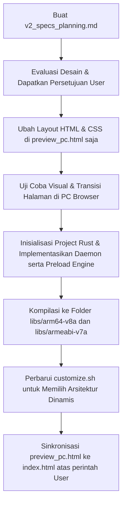

# Rencana Spesifikasi & Perencanaan Major Update LucaPro v2.0

Dokumen ini memuat rencana spesifikasi, arsitektur, dan perubahan besar (major update) untuk **LucaPro Support Utility v2.0**. Fokus utama dari update ini adalah memberikan pengalaman pengguna yang benar-benar baru, modern, dan segar (*fresh experience*) melalui antarmuka WebUI yang premium, tanpa mengorbankan utilitas dan performa pada perangkat berspesifikasi menengah ke bawah (khususnya Redmi Note 11 / SPES Snapdragon 680).

---

## 1. Filosofi Inti & Batasan Sistem v2.0
Meskipun antarmuka visual mengalami perombakan besar, aturan dasar dari modul LucaPro tetap dipertahankan demi menjaga kestabilan dan kepatuhan sistem:
- **Tetap Fokus pada Utilitas**: Fitur terbatas pada Charging Control, MLBB/Gaming downscale, pembersihan (Maintenance), dan diagnosik sistem.
- **TIDAK ADA Tweaks Kernel**: Tidak ada perubahan parameter kernel CPU/GPU/I-O yang berisiko merusak sistem atau membuat tidak stabil.
- **TIDAK ADA Thermal Throttling Control**: Menghindari modifikasi pengaman suhu bawaan demi keselamatan perangkat keras.
- **TIDAK ADA Power Saver Otomatis / Pembunuh Background Otomatis**: Semua pembersihan memori (RAM) dilakukan secara manual atas perintah pengguna untuk menghindari matinya aplikasi sistem penting.

---

## 2. Fitur Utama Visual: Hero Dashboard
Bagian atas halaman utama (*Home Tab*) akan memiliki **Hero Dashboard** yang menjadi pusat perhatian visual pertama kali ketika WebUI dibuka.

### Desain & Struktur Hero Dashboard
- **Banner Premium**: Menampilkan gambar utama dari `/webroot/assets/Luca-v6-AI.jpg` ([Luca-v6-AI.jpg](file:///D:/Module/LucaPro/webroot/assets/Luca-v6-AI.jpg)).
- **Efek Visual Overlay**: Gambar dihiasi dengan gradien gelap linear/radial (`rgba(6, 8, 12, 0) -> rgba(6, 8, 12, 1)`) di bagian bawah agar menyatu dengan latar belakang WebUI, serta efek pencahayaan neon tipis di sekeliling wadah banner.
- **Widget Terapung (Floating Widget)**: Di atas banner, terdapat informasi status dinamis yang bersih:
  - **Nama Modul & Versi**: `LucaPro Support v2.0` dengan logo bercahaya (glowing icon).
  - **Device & Kernel**: Deteksi otomatis nama model perangkat (contoh: *Redmi Note 11*) dan versi kernel yang sedang berjalan.
  - **Status Daemon**: Indikator LED neon hijau/merah yang menunjukkan status keaktifan daemon Rust `lucapro_helper`.
  - **Shortcut Cepat**: Tombol kecil berdesain minimalis untuk melakukan "Quick Clean" atau "Revert Settings" secara instan langsung dari area Hero Dashboard.

---

## 3. Antarmuka WebUI v2.0 (Premium & High-Performance)
Untuk mewujudkan antarmuka yang segar dan responsif, WebUI lama akan dirombak total menggunakan pendekatan desain modern berbasis *Vanilla CSS* dan *Modular JavaScript*.

### A. Alur Pengembangan UI Iteratif (Strategi Preview PC)
Sesuai kebutuhan pengujian yang aman:
- **Prioritas Pertama**: Semua perombakan UI, gaya, navigasi tab, dan efek transisi akan diimplementasikan terlebih dahulu di [preview_pc.html](file:///D:/Module/LucaPro/preview_pc.html).
- **Strategi Sinkronisasi**: File produksi utama [index.html](file:///D:/Module/LucaPro/webroot/index.html) **tidak akan disentuh** hingga seluruh pengujian visual pada [preview_pc.html](file:///D:/Module/LucaPro/preview_pc.html) selesai sepenuhnya dan mendapatkan instruksi sinkronisasi eksplisit dari pengguna.

### B. Palet Warna & Desain Opaque Tanpa Grafik (Fokus Performa Ekstrim)
Untuk menjamin respons sentuhan instan dan konsumsi CPU minimal pada Snapdragon 680 (SPES):
- **TIDAK ADA Glassmorphism**: Menghindari efek blur (`backdrop-filter`) dan transparansi bertumpuk yang membebani rendering GPU di WebUI Android.
- **TIDAK ADA Grafik/Chart**: Menghapus seluruh visualisasi grafik (seperti grafik suhu/arus baterai SVG/Canvas atau lingkaran progress memori). Seluruh data disajikan dalam teks angka/persentase solid dengan tata letak minimalis dan bersih untuk mengeliminasi beban rendering GPU/CPU.
- **TIDAK ADA Session History**: Menghapus riwayat sesi game sebelumnya (*Last Session Stats*) untuk mempercepat pemuatan halaman dan menyederhanakan data yang disimpan/diproses.
- **Latar Belakang & Kartu Solid**: Latar belakang Obsidian Black (`#04060a`) dipadukan dengan kartu/kontainer Solid Dark Charcoal (`#0c0f17`).
- **Aksen Neon Solid**: 
  - Cyber-Red (`#ff3b47`) untuk status non-aktif, suhu panas, atau revert.
  - Electric Teal/Cyan (`#00e5ff`) atau Emerald Green (`#00e676`) untuk status optimal, pengisian daya, dan fitur aktif.
- **Tipografi**: Menggunakan font sistem modern bebas hambatan (`system-ui, -apple-system, sans-serif`) dengan kontras tinggi untuk keterbacaan yang maksimal.

### C. Transisi Antar-Halaman yang Halus (Smooth Page Transitions)
Meskipun elemen visual lainnya statis dan berkinerja tinggi, navigasi antar-halaman akan menggunakan animasi transisi yang mulus:
- **Slide & Fade Page Transition**: Saat pengguna berganti tab/halaman, halaman aktif akan bergeser keluar dan halaman baru akan memudar masuk secara mulus menggunakan animasi CSS yang diakselerasi perangkat keras (*hardware-accelerated transition* memanfaatkan properti `transform` dan `opacity`).
- **Active Navigation Indicator**: Garis neon penunjuk tab aktif di navigasi bawah yang bergeser secara dinamis mengikuti tab yang dipilih.
---

## 4. Peningkatan Fitur Utilitas v2.0 (Utility Focus)

### A. Tanpa Action Button di Manager
- **Kebijakan Tombol**: Modul v2.0 **tidak menyediakan tombol aksi (Action Button)** di antarmuka utama KernelSU Manager.
- **Mekanisme**: File `action.sh` akan dihapus dari root paket modul. Dengan dihapusnya `action.sh`, KernelSU Manager secara otomatis menyembunyikan Action Button fisik.
- **Satu Pintu Akses**: Akses utilitas dilakukan secara eksklusif melalui tombol **"Open WebUI"** bawaan KernelSU yang membaca flag `webroot=true` di [module.prop](file:///D:/Module/LucaPro/module.prop).

### B. Power & Charging Suite (Tanpa Smart Bypass Otomatis)
1. **Charging Control Dasar**:
   - **Charging Limit Slider**: Membatasi tingkat pengisian daya maksimum baterai secara manual.
   - **Manual Charging Bypass Toggle**: Tombol cepat untuk mengaktifkan/menonaktifkan bypass pengisian daya (`input_suspend` atau `idle_mode`) secara langsung ketika charger terhubung.
2. **Kalkulator Daya Pengisian (Wattage Monitor)**:
   - Membaca tegangan (`voltage_now`) dan arus (`current_now`) dari `/sys/class/power_supply/battery/` secara real-time.
   - Mengalikan keduanya untuk menampilkan kecepatan pengisian aktual dalam satuan **Watt** (misal: "Charging at 18.3W").

### C. Game Optimization & Custom Overlay Suite
1. **Dukungan Multi-Game Package**:
   - Di v1.0, pengaturan downscale dan Game Mode API terkunci keras (*hardcoded*) untuk Mobile Legends (`com.mobile.legends`).
   - Di v2.0, WebUI akan menampilkan daftar game yang terpasang. Pengguna dapat menerapkan optimasi downscale resolution dan konfigurasi game mode overlay untuk game pilihan mereka secara individual.
2. **Peningkatan Skema Downscale**:
   - Mode downscale game overlay ditingkatkan agar lebih stabil pada Android 12 hingga Android 14.

---

## 5. Arsitektur Daemon: Migrasi Penuh ke Rust
Sebagai pengganti backend lama [lucapro_helper.cpp](file:///D:/Module/LucaPro/compile/lucapro_helper.cpp), seluruh logika helper daemon v2.0 akan **dimigrasi sepenuhnya ke bahasa pemrograman Rust**.

### A. Keuntungan Migrasi Rust
- **Keamanan Memori Maksimal**: Menghilangkan risiko segmentation fault, pointer liar, kebocoran memori (*memory leaks*), dan kesalahan konkurensi data thread.
- **Preloading & Page Locking Native**: 
  - Tidak memerlukan binary utilitas C eksternal seperti `vmtouch`.
  - Logika pemuatan (`mmap` & `madvise` dengan flag `MADV_WILLNEED`) dan penguncian RAM fisik (`mlock`) akan diimplementasikan secara langsung di dalam kode Rust menggunakan binding libc atau crate standard yang aman.
- **Parsing JSON Efisien**: Menggunakan penanganan data terstruktur yang cepat untuk menulis status modular secara berkala ke `/dev/lucapro_status.json` tanpa overhead yang tinggi.

### B. Distribusi Multi-Architecture ( libs/ )
Agar modul dapat diinstal dengan mulus dan efisien sesuai arsitektur CPU masing-masing perangkat:
- **Struktur Folder Build**: Output binari hasil kompilasi Rust akan dipisahkan berdasarkan target platform:
  - `libs/arm64-v8a/lucapro_helper` (Target Rust: `aarch64-linux-android`)
  - `libs/armeabi-v7a/lucapro_helper` (Target Rust: `armv7-linux-androideabi`)
- **Mekanisme Instalasi di [customize.sh](file:///D:/Module/LucaPro/customize.sh)**:
  - Skrip instalasi mendeteksi arsitektur target perangkat melalui variabel lingkungan `$ARCH` bawaan KernelSU/Magisk.
  - Memilih folder arsitektur yang cocok (contoh: jika `$ARCH` adalah `arm64`, pilih dari `libs/arm64-v8a/`).
  - Menyalin binary yang sesuai ke folder tujuan `$MODPATH/system/bin/lucapro_helper`.
  - Melakukan pembersihan (*cleanup*) dengan menghapus folder `libs/` di dalam direktori modul perangkat setelah pemasangan berhasil, guna menghemat kapasitas penyimpanan internal data perangkat.

---

## 6. Rencana Implementasi & Langkah Berikutnya

### Konfirmasi Sebelum Eksekusi Kode:
Sesuai dengan instruksi Anda, **kami tidak akan mengubah file kode apa pun** saat ini. Mohon tinjau rencana spesifikasi yang telah diperbarui di atas. Jika Anda menyetujui arah rencana migrasi Rust, multi-binary install, serta alur pengujian `preview_pc.html` ini, beritahukan kepada saya agar kita dapat menetapkan status siap pada perencanaan v2.0 ini.
